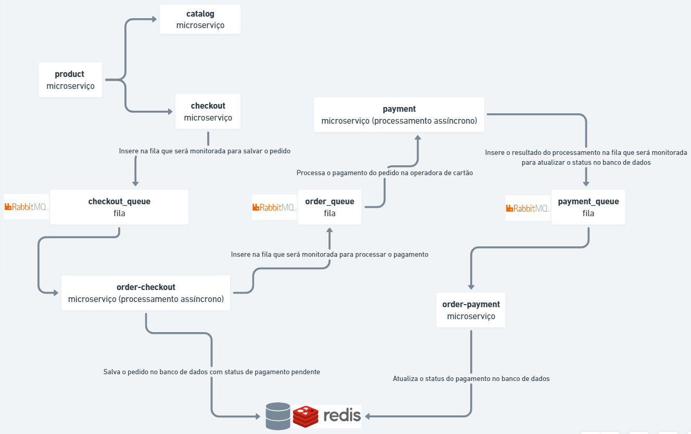

# Introdução a Microserviços com GO
Atividade final da aula ministrada por Emmanuel Neri na Pós-Graduação da UniALFA Umuarama de Desenvolvimento de Aplicações para Internet e Dispositivos Móveis.

<p align="center">
  
</p>

## Microserviço de produtos
API REST para disponibilizar informações do produto
```
Rotas disponíveis:
GET http://localhost:8080/products
GET http://localhost:8080/products/c32537ae-2124-4b92-893c-9f79183a77e4
```

## Microserviço de catálogo
Consome o microserviço de produtos via requisição HTTP e retorna os dados em um HTML simples
```
Rotas disponíveis:
GET http://localhost:8081/catalog
GET http://localhost:8081/catalog/products/c32537ae-2124-4b92-893c-9f79183a77e4
```

## Microserviço de checkout
Consome o microserviço de produtos via requisição HTTP e retorna os dados em um HTML simples com os campos nome, e-mail e telefone para simular a finalização de uma compra on-line e insere os dados em uma fila chamada checkout_queue
```
Rotas disponíveis:
GET http://localhost:8082/checkout/products/c32537ae-2124-4b92-893c-9f79183a77e4
POST http://localhost:8082/checkout/finish
```

## Microserviço de processamento assíncrono dos pedidos realizados no checkout
Consome os dados inseridos na fila checkout_queue, insere em um banco de dados Redis com o status de pagamento pendente, e em uma outra fila chamada order_queue

## Microserviço de processamento assíncrono do pagamento dos pedidos realizados no checkout
Consome os dados inseridos na fila order_queue para processar se o pagamento foi aprovado ou não, e insere o resultado em uma outra fila chamada payment_queue

## Microserviço de atualização do retorno de pagamento
Consome os dados inseridos na fila payment_queue e atualiza o status do pagamento do pedido no banco de dados

## Como rodar o código
```
docker-compose up -d
```